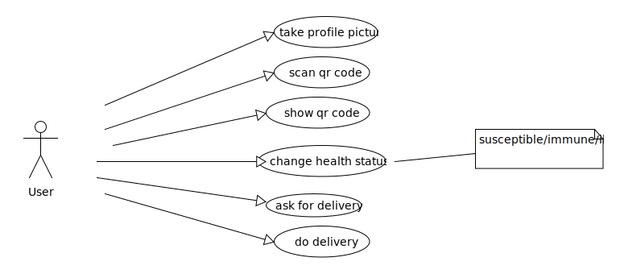

# App in the cloud

A project made under the supervision of the lecturer's team of Fontys Hogeschool Venlo. Using different technologies like Typescript, Swift, RESTful based json services to develop a dynamic Mobile Application for the IOS platform.

To succesfully pass the module, a set of learning goals have to be passed.

- LG1: Implement and use RESTful based json services in a mobile app
- LG2: Apply mobile frameworks, sensors and controls
- LG3: Design a GUI and implement it as an Android or iOSuser interface
- LG4: Unveil and share new technologies

Additionally, the mobile application also has to make use of the camera, map functionalities and send a push notification.

## Authors

* **Guus Damen** - [Guusda](https://github.com/Guusda)
* **Jonas Terschlüsen** - [Jonas2451](https://github.com/jonas2451)
* **Louisa Hereth** - [Louisahereth](https://github.com/louisahereth)
* **Sven Rediske** - [Svenrediske](https://github.com/Svenrediske)
* **Florian Blum** - [BlumFlorian](https://github.com/BlumFlorian)

See also the list of [contributors](https://github.com/FontysVenlo/prj4-2020-app-ios-2020-group09/graphs/contributors) who participated in this project.

## Documentation

### **Class Diagram**

### **Use Case Diagram**

## License

This project is licensed under the MIT License - see the [LICENSE.md](LICENSE.md) file for details

## Acknowledgments

